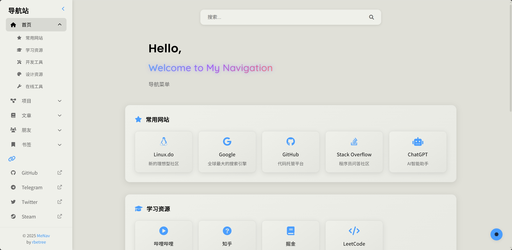
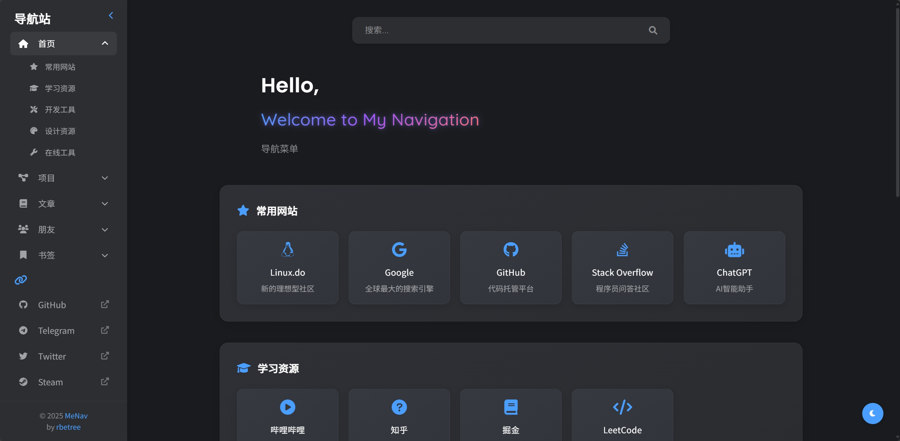

#  MeNav - 个人导航站

[](https://www.gnu.org/licenses/agpl-3.0.html)
[](https://github.com/rbetree/menav/stargazers)
[](https://github.com/rbetree/menav/network/members)

📋 一键部署的静态个人导航站 | ⚡ 自动化构建 | 🔖 支持书签导入

> MeNav是一个轻量级、高度可定制的个人导航网站生成器，让您轻松创建属于自己的导航主页。无需数据库和后端服务，完全静态部署，支持一键Fork部署到GitHub Pages，还可以从浏览器书签一键导入网站。MeNav is a lightweight, highly customizable personal navigation website generator. One-click deployment to GitHub Pages, automated build, bookmark import support, and more.

如果觉得项目有用，欢迎⭐Star/Fork支持，谢谢！


## 预览 | Preview

<table>
  <tr>
    <td><b>明亮主题 | Light Theme</b></td>
    <td><b>黑暗主题 | Dark Theme</b></td>
  </tr>
  <tr>
    <td></td>
    <td></td>
  </tr>
</table>

## 目录

- [预览](#预览--preview)
- [功能特点](#功能特点)
- [近期更新](#近期更新)
- [技术栈](#技术栈)
- [项目结构](#项目结构)
- [快速开始](#快速开始)
- [部署方式](#部署方式)
  - [部署到GitHub Pages](#快速部署到github-pages)
  - [部署到自己的服务器](#部署到服务器)
  - [其他CI/CD服务部署](#其他cicd托管选项)
- [配置指南](#设置模块化配置文件)
  - [使用配置](#使用配置)
  - [配置详解](#配置详解)
- [书签导入](#书签导入功能)
- [常见问题](#常见问题)
- [贡献指南](#贡献指南)
- [许可证](#许可证)

## 快速预览

[在线访问](https://rbetree.github.io/menav/)

## 功能特点

- 🎨 简洁美观的界面设计
- 📱 响应式布局，支持移动端
- 🔍 实时搜索功能
- 🎯 分类展示网站链接
- 👥 支持展示社交媒体链接
- 📝 支持多个内容页面
- 📌 支持从浏览器导入书签
- 🧩 模块化配置
- 🔄 可部署到GitHub Pages或任何类似的CI/CD服务，及任何服务器

## 近期更新

<details>
<summary>点击查看/隐藏更新日志</summary>

### 2025/05/04

**1. 移除双文件配置支持**
- ✅ 完全移除了对双文件配置方法的支持
- ✅ 简化了配置加载逻辑，现在仅支持模块化配置
- ✅ 保留配置迁移工具

### 2025/05/03

**1. 侧边栏收回功能**
- ✅ 添加侧边栏折叠/展开按钮，位于Logo文本右侧
- ✅ 侧边栏平滑折叠/展开过渡

**2. 移动端UI优化**
- ✅ 修复搜索按钮和侧边栏按钮遮挡问题
- ✅ 点击侧边栏导航项后自动收起侧边栏

**3. 配置加载优先级修复**
- ✅ 修复了模块化配置目录加载时的关键问题，确保site.yml中的fonts、profile和social配置正确应用
- ✅ 修复了home.yml中的categories配置未正确加载到导航首页的问题
- ✅ 增强了配置加载逻辑，确保按照优先级规则完整应用配置

### 2025/05/02

**1. 模块化配置**
- ✅ 支持将配置拆分为多个文件，便于管理和维护
- ✅ 引入配置目录结构，分离页面配置
- ✅ 保持向后兼容性，同时支持传统配置文件

### 2025/05/01

**1. 页面布局优化**
- ✅ 优化了内容区域和侧边栏的间距，确保各种分辨率下内容不会贴近边缘
- ✅ 卡片与边框始终保持合理间距，避免在窄屏设备上与滚动条贴边
- ✅ 调整了搜索结果区域的边距，与常规分类保持样式一致性

**2. 网站卡片文本优化**
- ✅ 为站点卡片标题添加单行文本截断，过长标题显示省略号
- ✅ 为站点描述添加两行限制和省略号，保持卡片布局整洁
- ✅ 添加卡片悬停提示，方便查看完整信息

**3. 移动端显示增强**
- ✅ 优化了移动端卡片尺寸，一屏可显示更多网址
- ✅ 图标大小自适应，在小屏幕上更加紧凑
- ✅ 为不同尺寸移动设备（768px、480px、400px）提供递进式UI优化
- ✅ 减小卡片内边距和元素间距，增加屏幕利用率

**4. 书签导入功能**
- ✅ 支持从Chrome、Firefox和Edge浏览器导入HTML格式书签
- ✅ 自动处理书签文件，解析文件夹结构和链接
- ✅ 智能匹配网站图标，根据URL自动分配合适的Font Awesome图标
- ✅ 生成配置文件，无需手动录入即可批量导入网站链接
- ✅ 与GitHub Actions集成，全自动化的导入和部署流程

</details>

## 技术栈

- HTML5 + CSS3
- JavaScript (原生)
- Font Awesome 图标
- GitHub Pages托管/其他各种CI/CD服务托管

## 项目结构

```bash
menav/
├── assets/           # 静态资源文件
│   ├── style.css     # 样式表
│   └── favicon.ico   # 网站图标
├── src/              # 源代码
│   ├── generator.js  # 静态网站生成器
│   ├── bookmark-processor.js # 书签导入处理器
│   ├── migrate-config.js # 配置迁移工具
│   └── script.js     # 前端JavaScript脚本
├── templates/        # HTML模板
│   └── index.html    # HTML骨架模板文件
├── dist/             # 生成的静态网站（由generator.js生成）
├── bookmarks/        # 书签导入目录
├── config/           # 模块化配置目录
│   ├── _default/     # 默认配置
│   │   ├── site.yml  # 网站基本配置
│   │   ├── navigation.yml # 导航配置
│   │   └── pages/    # 页面配置
│   │       ├── home.yml
│   │       ├── projects.yml
│   │       ├── articles.yml
│   │       ├── friends.yml
│   │       └── bookmarks.yml
│   └── user/         # 用户自定义配置
│       ├── site.yml  # 用户网站配置
│       ├── navigation.yml # 用户导航配置 
│       └── pages/    # 用户页面配置
```

## 快速开始

<details>
<summary>点击展开</summary>

通过以下步骤快速设置您的个人导航站：

1. 克隆仓库
```bash
git clone https://github.com/rbetree/menav.git
cd menav
```

2. 安装依赖
```bash
# 安装依赖
npm install
```

3. 修改配置
   - 在`config/user/`目录下创建配置文件
   - 至少需要创建`site.yml`和`navigation.yml`
   - 可以参考`config/_default/`目录结构和内容
   - 自定义站点标题、描述、导航链接和网站分类等

4. 本地预览
```bash
# 启动开发服务器
npm run dev
```

5. 构建静态网站
```bash
# 生成静态HTML文件
npm run build
```

构建后的文件位于`dist`目录，可以部署到任何静态网站托管服务。

</details>

## 部署方式

### 快速部署到GitHub Pages

<details>
<summary>点击展开</summary>

#### 第一步：前置设置

1. Fork仓库:
   - 点击右上角的 Fork 按钮复制此仓库到您的账号

2. 启用Actions:
   - 进入fork后的仓库
   - 点击顶部的 "Actions" 标签页
   - 点击绿色按钮 "I understand my workflows, go ahead and enable them"

3. 配置Pages:
   - 进入仓库的 Settings -> Pages
   - 在 "Build and deployment" 部分
   - Source: 选择 "GitHub Actions"

#### 第二步：自定义配置

1. 创建个人配置文件:
   - **重要:** 始终创建自己的用户配置文件，不要直接修改默认配置文件
   - 使用模块化配置（见[使用模块化配置](#使用模块化配置)）
   - 提交您的配置文件到仓库

2. 等待自动部署:
   - GitHub Actions会自动检测您的更改
   - 构建并部署您的网站
   - 部署完成后，您可以在 Settings -> Pages 中找到您的网站地址

> 重要提示: 请注意不要在配置文件中包含敏感信息，因为它将被提交到公开仓库。


**重要: Sync fork后需要手动触发工作流**:
- 当您使用GitHub界面上的"Sync fork"按钮同步本仓库的更新后
- GitHub Actions工作流不会自动运行
- 您需要手动触发构建流程:
  - 进入 Actions 标签页
  - 选择左侧的 "Build and Deploy" 工作流
  - 点击 "Run workflow" 按钮

</details>

### 部署到服务器

<details>
<summary>点击展开</summary>

如果您想部署到自己的Web服务器，只需要以下几个步骤：

1. 构建静态网站:
```bash
npm run build
```

2. 复制构建结果:
   - 所有生成的静态文件都位于 `dist` 目录中
   - 将 `dist` 目录中的所有文件复制到您的Web服务器根目录

3. 配置Web服务器:
   - 确保服务器配置为提供静态文件
   - 对于Apache: 在网站根目录中已有正确的 .htaccess 文件
   - 对于Nginx: 添加以下配置到您的server块:

```nginx
server {
    listen 80;
    server_name your-domain.com;
    root /path/to/dist;
    index index.html;

    location / {
        try_files $uri $uri/ /index.html;
    }
}
```

4. 更新配置:
   - 如果您想在服务器上更新网站，只需重复上述步骤1-2
   - 或者设置自动部署流程，例如使用GitLab CI/CD或Jenkins

</details>

### 其他CI/CD托管选项

<details>
<summary>点击展开</summary>

除了GitHub Pages外，您还可以使用其他各种CI/CD服务部署MeNav：

1. **Vercel**:
   - 在Vercel上导入您的GitHub仓库
   - 设置构建命令为`npm run build`
   - 设置输出目录为`dist`

2. **Netlify**:
   - 连接您的GitHub仓库
   - 设置构建命令为`npm run build`
   - 发布目录设置为`dist`

3. **Cloudflare Pages**:
   - 连接您的Git提供商
   - 设置构建命令为`npm run build`
   - 构建输出目录设置为`dist`

4. **GitLab Pages**:
   - 创建`.gitlab-ci.yml`文件
   - 配置Pages部署流程
   - 指定构建输出目录

5. **Azure Static Web Apps**:
   - 在Azure门户中创建新的静态Web应用
   - 关联您的代码库
   - 配置构建信息

无论选择哪种部署方式，请确保创建并使用您自己的配置文件，而不是直接修改默认配置。

</details>

## 设置模块化配置文件

MeNav使用模块化配置方式，将配置分散到多个文件中，更易于管理和维护。

> **🔔 重要提示：** 请务必在`config/user/`目录下创建并使用您自己的配置文件，不要直接修改默认配置文件，以便后续更新项目时不会丢失您的个性化设置。

在加载配置时遵循以下优先级顺序：
1. `config/user/` （模块化用户配置）（优先级最高）
2. `config/_default/` （模块化默认配置）

**注意：** 采用完全替换策略，而非合并。系统会选择存在的用户配置，完全忽略默认配置。

### 使用配置

模块化配置将配置分散到多个文件中，更易于管理和维护。

* **创建配置目录**:
   - 在`config/user/`目录下创建您的自定义配置文件
   - 可以参考项目结构中的`config/_default/`目录结构
   - 至少需要创建`site.yml`和`navigation.yml`

### 配置详解

<details>
<summary>点击展开</summary>

MeNav的配置系统分为三个主要部分，对应三种不同类型的配置文件：

1. `site.yml` - 网站基本信息、字体、个人资料和社交媒体链接
2. `navigation.yml` - 导航菜单配置
3. `pages/` 目录 - 各页面的内容配置

以下详细介绍每个配置文件的结构和用途。

### 一、site.yml 配置文件

site.yml文件包含网站的基本信息、字体设置、个人资料和社交媒体链接等全局配置，这些设置会影响整个网站的呈现。

```yaml
# 网站基本信息
title: "我的导航站"         # 网站标题，显示在浏览器标签和页面顶部
description: "个人网址导航"  # 网站描述，用于SEO和分享卡片
author: "张三"             # 作者姓名
favicon: "favicon.ico"     # 网站图标，支持ico、png等格式
logo_text: "导航站"         # 左上角显示的Logo文本

# 字体设置
fonts:
  title:  # 标题字体设置
    family: "Roboto"  # 字体名称
    weight: 700       # 字重值：400常规、500中等、700粗体
    source: "google"  # 字体来源：google或system
  subtitle:  # 副标题字体
    family: "Noto Sans SC"
    weight: 500
    source: "google"
  body:  # 正文字体
    family: "Noto Sans SC"
    weight: 400
    source: "google"
    
# 个人资料配置
profile:
  title: "欢迎来到我的导航站"       # 主标题/欢迎语
  subtitle: "收集实用网站和工具"    # 副标题
  description: "这里整理了我日常使用的网站和工具，方便快速访问。" # 详细描述

# 社交媒体链接
social:
  - name: "GitHub"
    url: "https://github.com/your-username"
    icon: "fab fa-github"
  - name: "Twitter"
    url: "https://twitter.com/your-username"
    icon: "fab fa-twitter"
  # 更多社交媒体...
```

> **📝 温馨提示**：
> - 关于**字体设置**：
>   - **system**表示使用系统自带字体，无需额外加载，页面加载速度更快
>   - **google**表示从Google Fonts加载字体，选择更丰富，但可能影响加载速度
>   - 中文网站推荐使用"Noto Sans SC"、"Source Han Sans CN"等支持中文的字体
>   - 设置字重时请确保所选字体支持该字重值，否则可能无法正确显示
> - 关于**个人资料**：profile.description支持较长文本，可以添加一些个性化的介绍或使用说明，让您的导航站更具特色
> - 关于**社交媒体链接**：这些链接会显示在网站侧边栏的底部，方便访问者联系您

### 二、navigation.yml 配置文件

navigation.yml文件定义网站左侧的导航菜单，支持添加多个自定义页面：

```yaml
# 导航菜单配置示例
- name: "首页"               # 菜单项名称
  icon: "fas fa-home"        # 菜单项图标
  id: "home"                 # 页面标识符（必须唯一）
  active: true               # 是否默认激活（只能有一个为true）
- name: "项目"
  icon: "fas fa-project-diagram"
  id: "projects"
  active: false
- name: "文章"
  icon: "fas fa-book"
  id: "articles"
  active: false
# 更多导航项...
```

> **📝 温馨提示**：
> - 每个导航项的`id`必须唯一，并且有对应的页面配置文件（该id必须与`pages/`文件夹中的页面配置文件名一致）
> - 只能设置一个导航项的`active`为`true`，作为默认显示页面
> - 图标使用Font Awesome 5图标库，格式为`前缀 fa-图标名`
> - 导航菜单的顺序与此配置文件中的顺序一致，可以通过调整项目顺序来更改导航顺序

### 三、pages目录 配置文件

pages目录包含每个页面的详细配置，每个文件对应一个页面。文件名必须与navigation.yml中的id一致。

例如，对于导航中的"home"页面，需要创建`config/user/pages/home.yml`：

```yaml
# pages/home.yml示例
title: "我的主页"          # 页面标题
subtitle: "常用网站导航"   # 页面副标题

# 分类和网站配置
categories:
  - name: "常用工具"          # 分类名称
    icon: "fas fa-tools"      # 分类图标
    sites:                    # 该分类下的网站列表
      - name: "GitHub"        # 网站名称
        url: "https://github.com"  # 网站链接
        icon: "fab fa-github"      # 网站图标
        description: "全球最大的代码托管平台"  # 网站描述
      - name: "Google"
        url: "https://google.com"
        icon: "fab fa-google"
        description: "全球最大的搜索引擎"
      # 更多网站...
  # 更多分类...
```

自定义页面配置示例（以"notes"为例）：

1. 首先在navigation.yml中添加对应的导航项：
```yaml
- name: "笔记"
  icon: "fas fa-sticky-note"
  id: "notes"
  active: false
```

2. 然后创建`config/user/pages/notes.yml`配置文件：
```yaml
title: "我的笔记收藏"          # 页面标题
subtitle: "学习和工作笔记资源"  # 页面副标题
categories:                   # 该页面的分类和网站
  - name: "编程笔记"
    icon: "fas fa-code"
    sites:
      - name: "Python学习笔记"
        url: "https://example.com/python-notes"
        icon: "fab fa-python"
        description: "Python编程技巧和案例"
      # 更多网站...
```

> **📝提示**：
> - 每个页面可以拥有不同的分类和网站
> - 网站描述建议简洁明了，不超过30个字符，以确保显示美观
> - 不同页面可以特化用于不同用途，如"工作"、"学习"、"娱乐"等
> - 页面数量不限，但建议控制在合理范围内，避免导航过长

### 四、Font Awesome图标指南

MeNav使用Font Awesome 5图标库，提供了丰富的图标选择：

**常用图标前缀**：
- `fas` - Font Awesome Solid (实心风格，最常用)
- `far` - Font Awesome Regular (线框风格)
- `fab` - Font Awesome Brands (品牌图标，用于各类网站品牌)

**如何选择合适的图标**：
1. 访问[Font Awesome官网](https://fontawesome.com/icons)搜索图标
2. 复制图标名称，加上前缀使用
3. 例如：`fas fa-book`、`fab fa-youtube`等

**网站图标匹配建议**：
- 对于知名网站和平台，优先使用`fab`前缀的品牌图标
- 对于通用功能网站，选择能代表其功能的图标，如词典类用`fas fa-book`
- 对于工具类网站，可使用`fas fa-tools`或更具体的工具图标

### 五、配置文件结构示例

**完整配置结构**：

```
config/user/
├── site.yml         # 网站基本信息、字体、个人资料和社交媒体链接
├── navigation.yml   # 导航菜单配置
└── pages/
    ├── home.yml     # 首页配置
    ├── projects.yml # 项目页配置
    ├── articles.yml # 文章页配置
    ├── friends.yml  # 朋友页配置
    └── notes.yml    # 自定义笔记页配置
```

### 六、常见配置问题解决

1. **配置后不生效**
   - 检查YAML格式是否正确，缩进是否一致
   - 确认修改的是用户配置文件（`config/user/`目录），而非默认配置文件
   - 运行`npm run dev`重新构建网站并查看

2. **图标不显示**
   - 确认图标名称和前缀是否正确（如`fas fa-home`）
   - 检查Font Awesome是否支持该图标（在官网搜索确认）
   - 注意图标名称中的连字符，如`fa-user-circle`而非`fa-usercircle`

3. **字体加载问题**
   - 确认Google字体名称拼写正确
   - 使用system来源时，确保使用的是通用系统字体
   - 中文字体推荐使用Noto Sans SC、Source Han Sans等支持中文的Google字体

4. **配置文件优先级问题**
   - 记住系统只会使用最高优先级的配置，不会合并不同配置
   - 检查您是否在多个地方定义了相同的配置，造成覆盖

> **📝 首次设置建议**：
> - 首先复制`config/_default/`目录中的文件到`config/user/`目录
> - 然后逐步修改各配置文件，保持目录结构一致
> - 使用文本编辑器时注意保持正确的YAML格式和缩进

</details>

## 书签导入功能

MeNav支持从浏览器导入书签，快速批量添加网站链接，无需手动录入。

> **🔔 重要提示**：系统只会处理位于文件夹内的书签，直接放在收藏夹根目录中的书签不会被导入。请确保您要导入的书签都放在文件夹中，每个文件夹将成为导航中的一个分类。

### 配置加载优先级

书签配置按以下优先级加载（从高到低）：

1. `config/user/pages/bookmarks.yml` （模块化用户配置）
2. `config/_default/pages/bookmarks.yml` （模块化默认配置）

**注意：** 书签配置采用完全替换策略，系统只会使用找到的最高优先级配置。

### 导入步骤详解

<details>
<summary>点击展开</summary>

1. **从浏览器导出书签**
   
   **Chrome**:
   - 打开Chrome菜单 (右上角三点图标)
   - 选择"书签" > "书签管理器"
   - 点击右上角三点图标，选择"导出书签"
   - 保存HTML文件到本地
   
   **Firefox**:
   - 点击书签菜单按钮
   - 选择"管理书签"
   - 在菜单栏选择"导入和备份" > "导出书签到HTML"
   - 保存文件到本地
   
   **Edge**:
   - 打开菜单 (右上角三点图标)
   - 选择"收藏夹"
   - 点击"更多选项" > "导出收藏夹"
   - 保存为HTML文件

2. **导入书签到MeNav**
   
   **GitHub Pages方式**:
   - Fork本仓库后，在您的仓库中创建`bookmarks`目录
   - 上传HTML格式书签文件到此目录
   - GitHub Actions会自动处理文件并生成配置
   
   **本地开发方式**:
   - 在项目根目录创建`bookmarks`文件夹
   - 复制HTML书签文件到此文件夹
   - 运行`npm run import-bookmarks`命令处理书签文件
   - 系统生成配置文件后即可使用`npm run dev`预览

3. **处理结果**
   
   处理完成后：
   - 书签分类会变成网站分类
   - 书签文件夹结构会被保留
   - 系统自动尝试匹配网站图标
   - 生成的配置可在`config/user/pages/bookmarks.yml`中查看和编辑

### 书签导入注意事项

- 仅支持标准HTML格式的书签文件（大多数浏览器导出格式）
- 每次只会处理目录中最新的一个书签文件
- 文件夹结构会保留，但可能需要手动调整图标和描述
- 处理完成后，原始书签文件会被自动删除，以防止重复处理
</details>

## 常见问题

<details>
<summary>模块化配置的优势是什么？</summary>
模块化配置将不同功能的配置分散到多个文件中，便于管理和维护。当网站内容较多时，分散的配置文件让您可以只关注需要修改的特定部分，避免配置文件变得臃肿难以编辑。
</details>

<details>
<summary>如何更改网站的主题或样式？</summary>
目前MeNav采用统一的设计风格，您可以通过修改`config/user/site.yml`中的字体设置来调整网站外观。未来版本将考虑增加主题切换功能。
</details>

<details>
<summary>可以添加自定义JS脚本吗？</summary>
当前版本不直接支持添加自定义JS。如果您需要此功能，可以考虑Fork项目后修改`templates/index.html`模板文件，添加您的自定义脚本。
</details>

<details>
<summary>导入的书签没有正确显示图标怎么办？</summary>
系统会尝试根据网址自动匹配Font Awesome图标。如果匹配不理想，您可以手动编辑`config/user/pages/bookmarks.yml`，修改每个站点的icon属性。
</details>

<details>
<summary>如何从旧式配置迁移到模块化配置？</summary>

由于MeNav已经移除了对旧式配置文件的支持，如果您仍在使用旧式配置文件，必须使用迁移工具进行转换：

1. 自动迁移方式：
   ```bash
   npm run migrate-config
   ```
   该命令会自动检测旧式配置文件，并将其全部转换为模块化配置格式。

2. 迁移过程：
   - 工具会识别`config.yml`、`config.user.yml`、`bookmarks.yml`和`bookmarks.user.yml`
   - 将它们转换并拆分到`config/user/`目录的对应文件中
   - 保留所有原始配置数据，不会丢失任何设置

3. 迁移后：
   - 所有配置将被放置在`config/user/`目录及其子目录
   - 迁移工具会告诉您可以安全删除的旧式配置文件
   - 新的模块化配置立即生效，无需额外设置

**重要提示**：MeNav现在只支持模块化配置文件。如果您仍在使用旧式配置，必须使用迁移工具进行转换才能继续使用最新版本的MeNav。
</details>

## 贡献指南

欢迎通过 Issues 或 Pull Requests 的形式做出贡献。如果您有好的想法或发现了问题，请随时提出。

## 许可证

[](https://www.gnu.org/licenses/agpl-3.0.html)

MeNav 基于 GNU Affero General Public License v3.0 (AGPL-3.0) 开源许可证发布。

主要条款：
- 允许商业使用、修改、分发、专利使用和私人使用
- 不提供任何担保
- 修改后的代码必须使用相同许可证
- 网络使用也视为分发，必须开源

在使用本项目时，请确保遵守AGPL-3.0协议的所有条款。完整许可证文本可在[LICENSE](LICENSE)文件中查看。 
